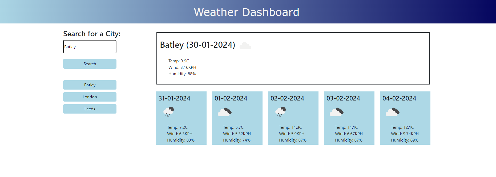

# weather-dashboard

For this challenge I created an app for travellers to see the weather outlook for multiple cities.

The weather dashboard allows a user to input a city and then it displays the current weather showing elements such as temperature, wind and humidity and it also displays this for the next 5 days.

I used a weather API to retrieve and display this data.

I also used local storage to store the user input and create a button for the user to go back to their previous searches.

https://sophieainsw.github.io/weather-dashboard/